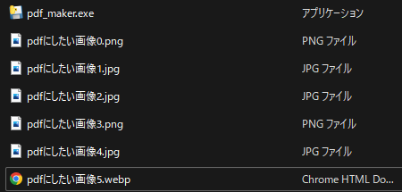

# pdf_maker
  
  
## まぁ、あれですよ！PDF作る奴！
  たぶん「jpg」,「png」,「webp」に対応してる
  
  
## 使い方(windows)
1. ダウンロードしていただいて
2. distの中にある実行ファイルを画像がいっぱい入ってるところに置きましょう
3. 起動したら画面に従っていくと多分何とかなります。

## 使い方(windows以外)
1. pythonを実行できる環境を用意してください
2. 気合で`pip install`してください
3. ファイルを画像がいっぱい入ってるところに置きましょう
4. 後は実行すれば多分何とかなる

## CUIの人
むり(分からん)

## 注意
* 画像がいっぱい入ってるファイルにtrashってファイルがあると多分エラーになる
* 作成されたPDFは基本的にあいうえお順になる(0→9, a→z)
* 画像の拡張子は小文字でお願いします
* 拡張子が違うファイルがあっても問題ありませんが、同じファイル名で違う拡張子のファイルがあると片方はPDFに保存されません。
* ロードしたファイル数とPDFのページ数は必ずしも一致しません。
* 動かなかったらしょうがない…

## 参考
使うときは、こんな感じに配置しましょう  

